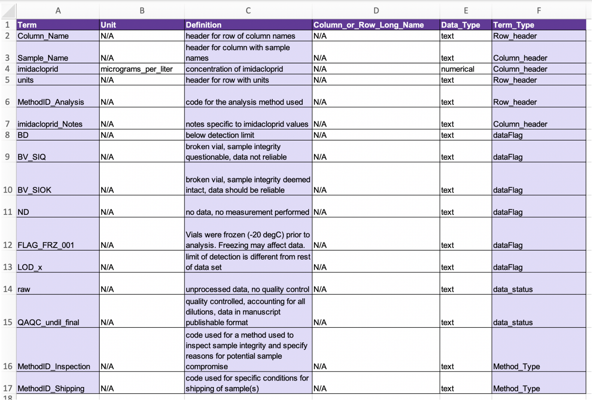

# Detailed Instructions for Data Dictionaries

It is required to include a data dictionary (\_dd.csv) for each csv file in a dataset, or a single data dictionary file for an entire dataset. As mentioned in the detailed instructions for the terminology file, it may be useful to generate a master terminology file that includes the required (and optional) fields for all csv files and then pull from there the relevant fields for each \_dd.csv file. Figure 1 shows an example of how a master terminology file could be structured to comply with the \_dd.csv template as well as the terminology template (i.e., by including the “Unit” and “Column_or_Row_Long_Name” fields, as well as “Term_Type”) in order to allow for a single master file collection of all terminology used within a dataset/project/team etc. Note that the Column header “Term” should be replaced by “Column_or_Row_Name” in all  \_dd.csv files.

The following instructions are from the [ESS-DIVE file level metadata reporting format](https://github.com/ess-dive-community/essdive-file-level-metadata) and are designed to facilitate File-Level Metadata extraction of some fields using the [File Level Metadata Extractor](https://code.ornl.gov/ngee-arctic/ess-dive-meta).

1. Create a CSV data dictionary using the [CSV_dd_template](https://github.com/ess-dive-community/essdive-file-level-metadata/blob/51f1a64260323d25754a693bce9a6f836ec3164f/CSV_dd/CSV_dd_template.xlsx). You can create either:
    
    a. One data dictionary for each data file or 
    
    b. One data dictionary representing all data files in your dataset

2. See the [CSV_dd_quick_guide](https://github.com/ess-dive-community/essdive-file-level-metadata/blob/master/CSV_dd/csv_dd_quick_guide.md) for more details about completing template

3. Enter a new row in the data dictionary for each column/row name in your data matrix
    
    a. Use "\*" wildcard when the description applies to multiple column/row names
   
   b. For example - if the same description applies to all spectra data column names in the data file(s)
      1. one row in the data dictionary can refer to "wave_\*" and this definition will be understood to apply to multiple column names within a data sheet

4. View an example [CSV_dd_example](https://github.com/ess-dive-community/essdive-file-level-metadata/blob/master/CSV_dd/csv_dd_example.md)

5. Save the CSV_dd template following the [CSV Reporting Format guidance](https://github.com/ess-dive-community/essdive-csv-structure) with the filename "dd.csv" or "\*\_dd.csv". Alternatively you may choose to name you data dictionary:
  
    a. With the same name as the associated data file, but include '\_dd.csv' at the end of the file name
   
    b. Create a unique filename for your data dictionary
   
    c. Incorporate a wildcard into the filename if data dictionary applies to multiple data files (for example - "soil_cores_\*_dd.csv")

### Notes

Following the recommended format and structure of the CSV Reporting Format will facilitate File-Level Metadata extraction of some fields using the [File Level Metadata Extractor](https://code.ornl.gov/ngee-arctic/ess-dive-meta).

**Figure 1.** Example of a terminology file that is structured to include all terms used by a project (i.e. including headers etc that are required in the \_dd.csv files) - i.e., serving as a complete dictionary. Note that the shaded fields are the only ones required for a terminology file included as part of a water-soil-sed-chem dataset, and the unshaded (appearing white) fields are added because they are required in the \_dd.csv files. If you prefer to keep the data dictionaries and the other terminology files separate, then disregard columns B and D above for the terminology file and remove column E (Term_Type) for the data dictionary files.
