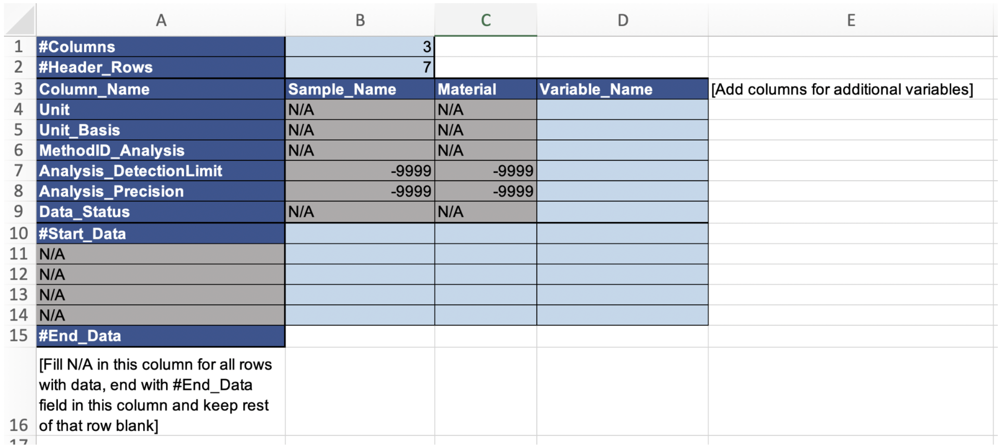
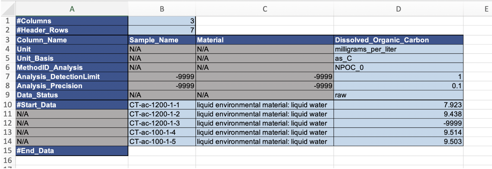

# Detailed Instructions for Data Files

We strongly recommend using the [Data_template](https://github.com/ess-dive-community/essdive-water-soil-sed-chem/blob/main/templates/Data_opt_template.csv) for your data files, as it will automatically ensure compliance with the reporting format and minimize issues with uploading your data package(s) to ESS-DIVE. The template was constructed to allow for ample flexibility in how to structure the data and, hence, be tailored to existing best practices or preferences used by data producers. Should you choose not to use the template, you will need to carefully follow all instructions and refer to the term_lists for this reporting format, as well as for those upstream of it ([Sample Metadata](https://ess-dive.gitbook.io/sample-id-and-metadata/), [csv](https://ess-dive.gitbook.io/csv-file-structure-reporting-format/), and [FLMD](https://ess-dive.gitbook.io/file-level-metadata-reporting-format/) reporting formats). It is also strongly recommended that you discuss your data file structure with an ESS-DIVE team member if you plan to deviate from the template.

**Minimum requirement template**

Figure 1 shows a screenshot of the excel version of the data template in its simplest form (i.e. with only required fields included), unfilled (top) and with example data (bottom). In this case, all cells that are not pre-populated with N/A, -9999, or are unshaded (i.e. appear white) must be populated with data/metadata: 

  1. Columns B (Sample_Name) and C (Material) must be populated with the exact same values as recorded in the Sample Metadata file for the samples included in your dataset. (This applies to all rows - i.e. row 10 and below - that contain a measurement value in Column D (and any additional columns with a Variable_Name).
  2. Replace Column D header (Variable_Name) with the name of the variable you are reporting data for. If you want to include data for more than one variable in the same file, simply add more columns to the right (columns E, F, G, etc.) and name them appropriately.
  3. Add the required metadata for each variable (rows 4-9 for column D and each column to the right with a Variable_Name). Descriptions, format recommendations, and examples for each metadata row are found in the [term_list_dataFile](https://github.com/ess-dive-community/essdive-water-soil-sed-chem/blob/main/term_lists/term_list_dataFile.md).
  4. Add your measurement values starting on row 10 in column D (and any additional columns with a Variable_Name).
  5. Save your populated and finalized file in csv-format and make sure your file name ends with “\_data.csv”. Note that only letters, numbers, underscores “\_”, and hyphens “-” are allowed in file names. It is recommended to maintain a consistent, informative, and simple naming structure for your files, as it will simplify the use of the “\*” wild card for associated data dictionary files (\_dd.csv) and potential automatic file level metadata generation. For example, all data from a specific field site, sampling campaign, and/or year would follow the same naming structure either in the front or end of the file names - e.g., “soil_chem_Riverton_2019_data.csv” and “groundwater_chem_Riverton_2019_data.csv” or “Riverton_2019_soil_chem_data.csv” and “Riverton_2019_groundwater_chem_data.csv”.

**Figure 1.**
*Top:* Data_template with only required fields included. Blue shading indicates required fields, gray shading indicates cells that will never contain data (note that they still need to be filled with “N/A” (text fields) or “-9999” (numerical fields), as no empty cells are allowed). *Bottom:* Example of populated data file with only the minimum required fields for a dataset with raw (i.e. straight off the instrument) dissolved organic carbon measurements in water samples. This example assumes a separate method file is included in the data package with explanations for the MethodID_Analysis code (NPOC_0). Also note the -9999 entry on row 12, which indicates missing data, but no information about why it is missing. Although this is allowed, it is strongly recommended to add a column to explain the reason for missing data. To do this, add column E and entitle it “Dissolved_Organic_Carbon_dataFlags” or “Dissolved_Organic_Carbon_Notes”  and add information on row 12 (all other rows in column E would be filled with N/A in this case) either as a dataFlag (i.e. a code that is explained in a separate [terminology file](https://github.com/ess-dive-community/essdive-water-soil-sed-chem/blob/main/Detailed_Instructions_Terminology_File.md)) or a note - see instructions and examples below.

**All optional and required fields template**

In addition to the required metadata fields for water/soil/sediment concentration data (explained above), we strongly recommend (if relevant) to include additional information (metadata) that will help others understand your dataset and its integrity, appropriateness, applicability etc. Hence, we suggest including any (or all) of the additional metadata columns and rows exemplified in Figure 2. Note that the example data in Figure 2 is from soil (rather than water) samples and, hence, is different from Figure 1, so direct comparisons between the two figures in terms of data and metadata is not possible (we are attempting to include several different types of data in these examples). As in Figure 1, all fields shaded in blue are required, but in this case there are also unshaded (i.e. appearing white) fields with (meta)data. Note that both rows (6-8 and 12) and columns (F-I) with metadata have been added to this data file compared to the minimum requirement template explained above. As a consequence, the numbers entered into column B, rows 1 and 2 (no of columns and no of header rows) have been changed to match the current layout.

If you wish to add metadata outside of what is required, follow these steps:
  1. _**Metadata that is the same for every sample**_ for a specific variable within the same data file should be _**added as a header row**_ (e.g., MethodIDs for storage, preparation, data analysis etc that is common practice across all samples within the dataset)
  3. _**Metadata that is specific to a sample**_ should be entered into a _**separate column**_, which could be communal to all variables reported within the dataset (in which case it would be inserted to the left of the first Variable_Name column and be entitled with an appropriate header, e.g. DataFlags, Notes) or specific to one variable (in which case it should be added to the right of that variable and include the Variable_Name in the header, e.g. Total_Carbon_DataFlags). This is best practice for reporting deviations from the normal protocols/metadata for individual samples, e.g., if one out of three replicate vials broke before any analysis (add in communal column to the left of all data columns) or if the measured value was noted as an outlier (add in column specific to the variable for which the outlying measurement was recorded).
  4. Make sure to change the numbers in column B, rows 1 (no of columns, excluding column A) and 2 (no of header rows, excluding rows 1 and 2) to match the modified data file structure.
  5. Add data and metadata as instructed above, making sure that all cells are filled (use N/A or -9999 for missing text and numerical values, respectively).
  6. Note that columns B-D in Figure 2 must contain the exact same values as entered into the sample metadata file for the corresponding samples.
  7. Note that all date and time stamps must be reported in ISO standard format: yyyy-mm-dd hh:mm:ss, with the option to cut at the appropriate level of detail (e.g., yyyy-mm-dd or yyyy-mm-dd hh:mm). If a timestamp is included, it is also required to report the UTC offset (even if the time is reported in UTC, in which case the offset would be 0).

**Figure 2.** Example of populated data file with all required and optional fields for a dataset with “final” (i.e. quality controlled, averaged, and otherwise processed - note that it should be specified in terminology or method file what “Final” means for your data) total carbon measurements in soil samples. 

**Optional shifts between rows and columns for (meta)data**

As mentioned above, it is optional whether metadata is reported in columns or rows, depending on what makes the most sense for a particular dataset. It is recommended to report data for a specific variable in a single column (i.e. samples are listed in rows, as shown in the examples here), but it is also possible to switch this around, so that each sample has its own column, whereas variables and metadata are listed in rows, if this makes more sense for your dataset. It is required to report the structure of your (meta)data in the FLMD for each file.

Figure 3 shows an example of a dataset (yearly measurements of imidacloprid concentrations in surface water samples) where the analytical method changed during the time series and with it also the detection limit. Also, the detection limit varied slightly between sampling occasions, even with the same analytical method. Hence, in this case the most appropriate way is to report MethodID_Analysis and Analysis_DetectionLimit for each individual sample and, hence, these required metadata are switched from header rows to columns to the right of the data column for imidacloprid. Although not required, it is prudent in this situation to add a column with notes to explain and notify data users about this shift. Note that, in spite of the detailed information about detection limits, there is no information available about analytical precision for this data (i.e. -9999 is recorded in the Analysis_Precision field).

**Figure 3.** Example of a data file with some of the required metadata shifted from header rows (i.e., common to all samples for that variable) to columns (i.e., different for some or all samples for a specific variable). Note that the numbers in rows 1 and 2 for column B have been changed to reflect the change in data structure.

**Other options**

There are a multitude of other options for how to structure and report your datasets and still remain compliant with the template and the reporting format. Some examples include:
  - Adding other types of metadata (in header rows or columns) - for example, additional sample handling methods (e.g., inspection methods, extraction methods) or method deviations (for individual samples)
  - Reporting units and unit basis only in the data dictionary, “_dd.csv” file.
  - Reporting analysis detection limit and/or precision in the Method file (i.e. if these remain the same for the entire data package where data for this Method is included)
  - Reporting data status in FLMD only, i.e., if all data in a file is in the same status (e.g., raw or final), this can be stated in the file level metadata and may in that case be excluded from the data file itself.

Note that any deviations from the provided templates and examples may result in complications during your data package upload and it is strongly recommended that you confirm with an ESS-DIVE representative that your data (and other) files are indeed compliant with all relevant reporting formats.
